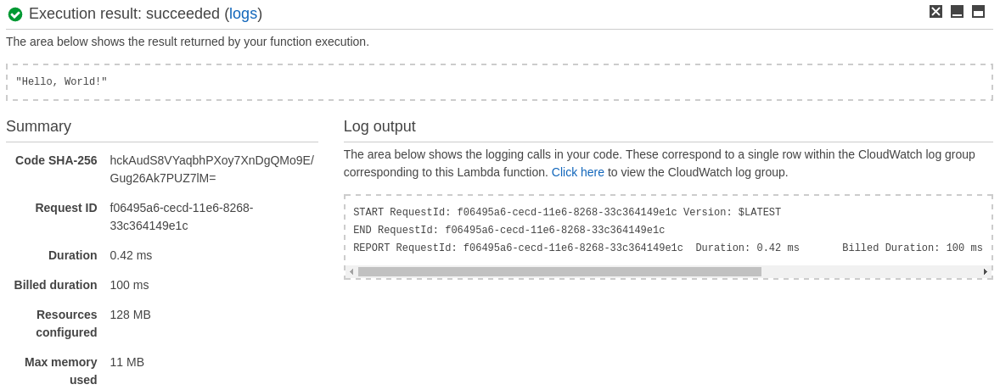

<a id="top" name="top"></a>
[][aws-home]
[][eawsy-home]

# eawsy/aws-lambda-go-shim

> Author your AWS Lambda function code in Go.

[![Status][badge-status]](#top)
[![License][badge-license]](LICENSE)
[![Chat][badge-chat]][eawsy-chat]

[AWS Lambda][aws-lambda-home] lets you run code without provisioning or managing servers. 
[For now][aws-lambda-lng], you can author your Lambda function code in Node.js, Java, C# and Python, but not in Go.
This project fills the gap.

## Table of Contents

  - [Quick Hands-On](#quick-hands-on)
    - [Dependencies](#dependencies)
    - [Create](#create)
    - [Build](#build)
    - [Configure](#configure)
    - [Deploy](#deploy)
    - [Invoke](#invoke)
  - [Programming Model](#programming-model)
    - [Handler](#handler)
    - [Context](#context)
    - [Logging](#logging)
    - [Errors](#errors)
  - [Deployment Package](#deployment-package)
    - [Default Configuration](#default-configuration)
    - [Custom Handler](#custom-handler)
    - [Custom Package](#custom-package)
  - [About](#about)
  - [Contact](#contact)
  - [License](#license)
  - [Trademark](#trademark)

[](#top)
## Quick Hands-On

[](#top)
### Dependencies

```sh
go get -u -d github.com/eawsy/aws-lambda-go-core/...
docker pull eawsy/aws-lambda-go-shim
wget -O Makefile https://github.com/eawsy/aws-lambda-go-shim/raw/master/src/Makefile.example
```

[](#top)
### Create

```go
package main

// /* Required, but no C code needed. */
import "C"

import (
	"encoding/json"

	"github.com/eawsy/aws-lambda-go-core/service/lambda/runtime"
)

func Handle(evt json.RawMessage, ctx *runtime.Context) (interface{}, error) {
	return "Hello, World!", nil
}
```

[](#top)
### Build

```sh
make
```

[](#top)
### Configure

If you've already created a lambda function via the AWS console, you can skip this step since the `lambda_basic_execution` role will have already been created for you.

```
cat > trust-policy.json <<EOL
{
  "Version": "2012-10-17",
  "Statement": [{
    "Effect": "Allow",
    "Principal": {
      "Service": "lambda.amazonaws.com"
    },
    "Action": "sts:AssumeRole"
  }]
}
EOL

aws iam create-role --role-name lambda_basic_execution --assume-role-policy-document file://trust-policy.json
aws iam attach-role-policy --role-name lambda_basic_execution --policy-arn arn:aws:iam::aws:policy/service-role/AWSLambdaBasicExecutionRole

```

[](#top)
### Deploy 

```sh
aws lambda create-function \
  --role arn:aws:iam::AWS_ACCOUNT_NUMBER:role/lambda_basic_execution \
  --function-name preview-go \
  --zip-file fileb://package.zip \
  --runtime python2.7 \
  --handler handler.Handle
```

[](#top)
### Invoke

<kbd></kbd>

[](#top)
## Programming Model

> Although not required, we recommand you review [AWS Lambda Developer Guide][aws-lambda-doc] first.

This section explains how [common programming patterns and core concepts][aws-lambda-model] apply when authoring AWS 
Lambda function code in Go.

[](#top)
### Handler

The handler is an **exported function** in your code, that AWS Lambda invokes when executing your code.

```go
func Handle(evt json.RawMessage, ctx *runtime.Context) (interface{}, error) {
  ...
}
```

  - AWS Lambda uses `evt` parameter to pass in event data to the handler. An automatic JSON unmarshalling is performed
    before passing in the data, so that you can **use any valid Go type**. Refer to 
    [eawsy/aws-lambda-go-event][eawsy-event] for AWS services event definitions.

    ```go
    func Handle(evt *MyCustomType, ctx *runtime.Context) (interface{}, error) {
      ...
    }
    ```

  - AWS Lambda uses `ctx` parameter to provide runtime information to the handler. Refer to
    [eawsy/aws-lambda-go-core][eawsy-core] for more details.

  - The handler can either **return any valid Go value** or an error. What happens to the result depends on the 
    invocation type. In a synchronous execution, AWS Lambda returns the result, serialized in JSON, to the client.

    ```go
    func Handle(evt json.RawMessage, ctx *runtime.Context) (*MyCustomType, error) {
      ...
    }
    ```

[](#top)
### Context

The context is an object containing runtime information, that AWS Lambda passes as the second parameter of the handler 
when executing your code. Refer to [eawsy/aws-lambda-go-core][eawsy-core] for more details.

  - `RemainingTimeInMillis()` returns the remaining execution time, in milliseconds, until Lambda terminates the 
    function.

  - `FunctionName` is the name of the Lambda function that is executing.

  - `FunctionVersion` is the version of the Lambda function that is executing. If an alias is used to invoke the 
    function, then it will be the version the alias points to.

  - `InvokedFunctionARN` is the ARN used to invoke this function. It can be function ARN or alias ARN. An unqualified 
    ARN executes the $LATEST version and aliases execute the function version it is pointing to.

  - `MemoryLimitInMB` is the memory limit, in MB, you configured for the Lambda function.

  - `AWSRequestID` is the AWS request ID associated with the request. This is the ID returned to the client. If Lambda 
    retries the invocation (in case of execution failure), the AWS request ID remains the same.

  - `LogGroupName` is the name of the CloudWatch log group where you can find logs written by your Lambda function.

  - `LogStreamName` is the name of the CloudWatch log stream where you can find logs written by your Lambda function. 
    The log stream may or may not change for each invocation of the Lambda function.

  - `Identity` is the information about the Amazon Cognito identity provider when invoked through the AWS Mobile SDK.

  - `ClientContext` is the information about the client application and device when invoked through the AWS Mobile SDK.

[](#top)
### Logging

The handler can contain logging statements by **using the standard Go [`fmt`][misc-go-fmt] or [`log`][misc-go-log] 
packages**. Both `fmt` and `log` functions write logs to AWS CloudWatch Logs but the `log` functions write additional 
information to each log entry, such as timestamp and request id.

  - `fmt.Print[f|ln]`

    ```go
    func Handle(evt json.RawMessage, ctx *runtime.Context) (interface{}, error) {
        fmt.Println("Hello, World!")
        return nil, nil
    }

    // Hello, World!
    ```

  - `log.Print[f|ln]`, `log.Fatal[f|ln]`, `log.Panic[f|ln]`

    ```go
    func Handle(evt json.RawMessage, ctx *runtime.Context) (interface{}, error) {
        log.Println("Hello, World!")
        return nil, nil
    }

    // 2017-01-01T00:00:00.000Z	12ad5f64-d111-11e6-b4b4-b757a100146b	Hello, World!
    ```

[](#top)
### Errors

The handler can **return any standard Go error**. AWS Lambda recognizes the error and serializes its information into 
JSON and returns it to the client.

```go
func Handle(evt json.RawMessage, ctx *runtime.Context) (interface{}, error) {
    return nil, errors.New("Oh, Snap!")
}

// {
//  "errorMessage": "Oh, Snap!"
// }
```

It is worth noting that if the handler panics, the returned error will be generic but the stack trace will be logged.

```go
func Handle(evt json.RawMessage, ctx *runtime.Context) (interface{}, error) {
    panic("Oh, Snap!")
    return nil, nil
}

// {
//  "errorMessage": "RequestId: 7322cf9e-d10d-11e6-ad86-d3cd48e293cf Process exited before completing request"
// }
```

[](#top)
## Deployment Package

> Although not required, we recommand you review [AWS Lambda Developer Guide][aws-lambda-doc] first.

This section explains how to build AWS Lambda function code in Go, create a Zip package and configure deployment. 

To streamline common use cases, we provide an [example `Makefile`](src/Makefile.example) with two environment variables
(`HANDLER` and `PACKAGE`) to control the name of the generated binary and package. Feel free to customize build flags, 
append static assets to the package, etc.

[](#top)
### Default Configuration

By default, `HANDLER` is set to `handler` and `PACKAGE` to `package`.

  - Create

    ```go
    func Handle...
    ```

  - Build

    ```sh
    make
    # handler.so
    # package.zip
    ```

  - Deployment
    - Runtime: Python 2.7
    - Handler: **handler.Handle**

[](#top)
### Custom Handler

By setting `HANDLER` to `foo`, the generated binary becomes `foo.so`.

  - Create

    ```go
    func Bar...
    ```

  - Build

    ```sh
    HANDLER=foo make
    # foo.so
    # package.zip
    ```

  - Deployment
    - Runtime: Python 2.7
    - Handler: **foo.Bar**

[](#top)
### Custom Package

By setting `PACKAGE` to `baz`, the generated package becomes `baz.zip`.

  - Create

    ```go
    func Handle...
    ```

  - Build

    ```sh
    PACKAGE=baz make
    # handler.so
    # baz.zip
    ```

  - Deployment
    - Runtime: Python 2.7
    - Handler: **handler.Handle**

[](#top)
## About

[][eawsy-home]

This project is maintained and funded by Alsanium, SAS.

[We][eawsy-home] :heart: [AWS][aws-home] and open source software. See [our other projects][eawsy-github], or 
[hire us][eawsy-hire] to help you build modern applications on AWS.

[](#top)
## Contact

We want to make it easy for you, users and contributers, to talk with us and connect with each others, to share ideas, 
solve problems and make help this project awesome. Here are the main channels we're running currently and we'd love to 
hear from you on them.

### Twitter 
  
[eawsyhq][eawsy-twitter] 

Follow and chat with us on Twitter. 

Share stories!

### Gitter 

[eawsy/bavardage][eawsy-chat]

This is for all of you. Users, developers and curious. You can find help, links, questions and answers from all the 
community including the core team.

Ask questions!

### GitHub

[pull requests][eawsy-pr] & [issues][eawsy-issues]

You are invited to contribute new features, fixes, or updates, large or small; we are always thrilled to receive pull 
requests, and do our best to process them as fast as we can.

Before you start to code, we recommend discussing your plans through the [eawsy/bavardage channel][eawsy-chat], 
especially for more ambitious contributions. This gives other contributors a chance to point you in the right direction, 
give you feedback on your design, and help you find out if someone else is working on the same thing.

Write code!

[](#top)
## License

This product is licensed to you under the Apache License, Version 2.0 (the "License"); you may not use this product 
except in compliance with the License. See [LICENSE](LICENSE) and [NOTICE](NOTICE) for more information.

[](#top)
## Trademark

Alsanium, eawsy, the "Created by eawsy" logo, and the "eawsy" logo are trademarks of Alsanium, SAS. or its affiliates in 
France and/or other countries.

Amazon Web Services, the "Powered by Amazon Web Services" logo, and AWS Lambda are trademarks of Amazon.com, Inc. or its 
affiliates in the United States and/or other countries.

[eawsy-home]: https://eawsy.com
[eawsy-github]: https://github.com/eawsy/
[eawsy-chat]: https://gitter.im/eawsy/bavardage
[eawsy-twitter]: https://twitter.com/@eawsyhq
[eawsy-hire]: https://docs.google.com/forms/d/e/1FAIpQLSfPvn1Dgp95DXfvr3ClPHCNF5abi4D1grveT5btVyBHUk0nXw/viewform
[eawsy-core]: https://github.com/eawsy/aws-lambda-go-core
[eawsy-event]: https://github.com/eawsy/aws-lambda-go-event
[eawsy-pr]: https://github.com/eawsy/aws-lambda-go-shim/issues?q=is:pr%20is:open
[eawsy-issues]: https://github.com/eawsy/aws-lambda-go-shim/issues?q=is:issue%20is:open

[aws-home]: https://aws.amazon.com
[aws-lambda-home]: https://aws.amazon.com/lambda
[aws-lambda-lng]: http://docs.aws.amazon.com/lambda/latest/dg/lambda-app.html#lambda-app-author
[aws-lambda-doc]: http://docs.aws.amazon.com/lambda/latest/dg/welcome.html
[aws-lambda-model]: http://docs.aws.amazon.com/lambda/latest/dg/programming-model-v2.html

[misc-go-fmt]: https://golang.org/pkg/fmt/
[misc-go-log]: https://golang.org/pkg/log/

[badge-chat]: http://img.shields.io/badge/chat-gitter-e91e63.svg?style=flat-square
[badge-status]: http://img.shields.io/badge/status-beta-827717.svg?style=flat-square
[badge-license]: http://img.shields.io/badge/license-apache-757575.svg?style=flat-square
