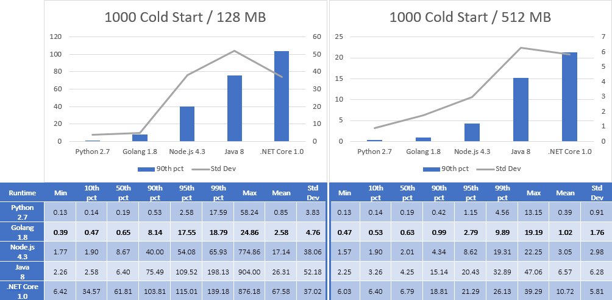

<a id="top" name="top"></a>

[][aws-home]
[][eawsy-home]

# eawsy/aws-lambda-go-shim

> Author your AWS Lambda functions in Go, effectively.

[![Status][badge-status]](#top)
[![License][badge-license]](LICENSE)
[![Help][badge-help]][eawsy-chat]
[![Social][badge-social]][eawsy-twitter]

[AWS Lambda][aws-lambda-home] lets you run code without thinking about servers. [For now][aws-lambda-lng], you can 
author your AWS Lambda functions, natively, in [C#][aws-lambda-csharp], [Java][aws-lambda-java], 
[Node.js][aws-lambda-nodejs] and [Python][aws-lambda-python]. This project provides a **native** and **full-featured** 
shim for authoring your AWS Lambda functions in Go.

[](#top)
## Preview

```go
package main

import "github.com/eawsy/aws-lambda-go-core/service/lambda/runtime"

func Handle(evt interface{}, ctx *runtime.Context) (string, error) {
	return "Hello, World!", nil
}
```
```sh
wget -qO- https://github.com/eawsy/aws-lambda-go-shim/raw/master/src/preview.bash | bash
# "Hello, World!" executed in 0.45 ms
```

:hatching_chick: If you like the experience, please [spread the word][eawsy-spread]!

[](#top)
## Features

[Serialization](#handler-signature) | [Context](#runtime-context) | [Logging](#logging)    | [Exceptions](#exceptions) | [Environment][golang-env] | [Events][eawsy-evt]     | [API Gateway][eawsy-net]
:---------------------------------: | :-------------------------: | :--------------------: | :-----------------------: | :-----------------------: | :---------------------: | :----------------------:
[![OK][ok]](#features)              | [![OK][ok]](#features)      | [![OK][ok]](#features) | [![OK][ok]](#features)    | [![OK][ok]](#features)    | [![OK][mok]](#features) | [![OK][ok]](#features)

[](#top)
## Performance

> DISCLAIMER:
  We do not intend to compare Go with other languages but to appreciate the overhead of our shim compared to officially
  supported AWS Lambda languages.

:sunglasses: It is the 2nd fastest way to run an AWS Lambda function and makes the Node.js *spawn process* technique 
obsolete.



[](#top)
## How It Works

[](#top)
### TL;DR

- 0 - Requirements

  ```sh
  docker pull eawsy/aws-lambda-go-shim:latest
  go get -u -d github.com/eawsy/aws-lambda-go-core/...
  wget -O Makefile https://git.io/vytH8
  ```

- 1 - Code

  ```go
  package main

  import (
    "encoding/json"

    "github.com/eawsy/aws-lambda-go-core/service/lambda/runtime"
  )

  func Handle(evt json.RawMessage, ctx *runtime.Context) (interface{}, error) {
    // ...
  }
  ```

- 2 - Build

  ```sh
  make
  ```

- 3 - Deploy

  ```sh
  Runtime: python2.7
  Handler: handler.Handle
  ```

[](#top)
### Under the Hood

Considering for example the above preview section, we have the following structure:

```
.
└── preview
    ├── handler.go
    └── Makefile
```

The `handler.go` file is where resides the main entrypoint of your AWS Lambda function. There is no restriction on how
many files and dependencies you can have, nor on how you must name your files and functions. Nevertheless however we 
advocate to retain the `handler` name and to use `Handle` as the name of your entrypoint. 

Let's review the content of `handler.go`:

```go
1 package main
2 
3 import "github.com/eawsy/aws-lambda-go-core/service/lambda/runtime"
4 
5 func Handle(evt interface{}, ctx *runtime.Context) (string, error) {
6 	return "Hello, World!", nil
7 }
```

[](#top)
#### main package

For a seamless experience we leverage [Go 1.8 plugins][golang-plug] to separate the shim from your code. At run time, 
AWS Lambda loads our pre-compiled shim which in turn loads your code (your plugin). A plugin is a 
**Go main package** and that is why your entrypoint **must** be in the main package, as seen at line 1. Notice that this
restriction only applies to your entrypoint and you are free to organize the rest of your code in different packages.

[](#top)
#### runtime context

While your function is executing, it can interact with AWS Lambda to get useful runtime information such as, how much 
time is remaining before AWS Lambda terminates your function, the AWS request id, etc. This information is passed as the 
second parameter to your function via the `runtime.Context` object, as seen at line 5.  
With [`eawsy/aws-lambda-go-core`][eawsy-ctx] we empower you with a full-featured context object to **access any 
available information** in the exact same way that official AWS Lambda runtimes do. This is the only dependency you ever 
need, as seen in line 3. 

[](#top)
#### get dependencies

`eawsy/aws-lambda-go-core` dependency can be retrieved using the well known `go get` command:

```sh
go get -u -d github.com/eawsy/aws-lambda-go-core/...
```

[Go vendoring][golang-vnd] is also supported out of the box and behaves the same way expected when building usual go 
projects:

- If the `preview` folder is inside `GOPATH`, then `vendor` folder prevails over `GOPATH` dependencies.
- If the `preview` folder is outside `GOPATH`, then `vendor` folder is ignored in favor of `GOPATH` dependencies.

[](#top)
#### handler signature

```go
5 func Handle(evt interface{}, ctx *runtime.Context) (string, error) {
6 	return "Hello, World!", nil
7 }
```

For AWS Lambda being able to call your handler, you have to [make it visible][golang-name] outside your plugin, as seen
at line 5. There is no other naming restriction but keep in mind that if you change the name of your function, you must
also update it in the [AWS Lambda configuration](#deployment).

> Tip: Use a variable to expose a handler from the inside of a package:
  ```go
  var Handle = mypackage.MyHandle
  ```

For the rest, the handler follows the [AWS Lambda programming model][aws-lambda-model] by:

- Taking 2 parameters:
  - **Event** – Event data is **automatically json unmarshalled** and passed as the first argument.  
    You are free to use the well known [`json.RawMessage`][golang-jsonraw] type, any other valid Go type or even your 
    own custom type. We also provide an [extensive set of predefined event definitions][eawsy-evt] if you plan to play 
    with [AWS Lambda event source mapping][aws-lambda-map].
  - **Context** – Context information is passed as the second argument [as explained above](#runtime-context).

- Returning 2 values:
  - **Result** – The first return value is **automatically json marshalled** and forwarded back to the client.  
    You are free to use the well known `interface{}` type, any other valid Go type or even your own custom type to 
    leverage [fine grained json marshalling][golang-jsoncus].
  - **Error** – The second return value notify AWS Lambda an error occurred during execution. As expected it prevails 
    over the first return value.

[](#top)
#### logging

In line with the [AWS Lambda programming model][aws-lambda-model], one should be able to output logs using standard
abilities of the language. Your function can contain logging statements using the official [Go log package][golang-log]
and AWS Lambda writes theses logs to [AWS CloudWatch Logs][aws-cw-logs] asynchronously. There is no restriction on how 
to configure or use the Go log package.

```go
package main

import (
	"log"

	"github.com/eawsy/aws-lambda-go-core/service/lambda/runtime"
)

func Handle(evt interface{}, ctx *runtime.Context) (interface{}, error) {
	log.Println("Hello, World!")
	return nil, nil
}
```

[](#top)
#### exceptions

In the course of a normal and controlled execution flow, you can notify AWS Lambda an error occurred by returning an 
`error` as [explained above](#handler-signature).  
In case of unexpected situations when the ordinary flow of control stops and begins *panicking* and if you have not any
[recover mechanism][golang-recover] in place, then the stack trace is logged in AWS CloudWatch Logs and AWS Lambda is
notified an error occurred.

[](#top)
#### building

We provide a [Docker image][eawsy-docker] based on [Amazon Linux container image][aws-docker-image] to build your binary
in the exact same environment than AWS Lambda. This image embeds our pre-compiled shim along with helper scripts to
package your function. You can use it as such or [build your own custom image][docker-custom] from it:

```sh
docker pull eawsy/aws-lambda-go-shim:latest
```

Although not strictly required, we also provide an [example Makefile](src/Makefile.example) to streamline common use
cases. You are free to customize, modify and adapt it to your needs. Let's review its content briefly:

```Makefile
HANDLER ?= handler
PACKAGE ?= $(HANDLER)

docker:
  @docker run ...

build:
  @go build ...

pack:
  @pack ...
```

- **Customize** – The first two environment variables allow you to customize the name of your handler and the generated 
  package:

  ```sh
  make
  .
  └── preview
      ├── handler.go
      ├── handler.so
      ├── handler.zip
      └── Makefile
  ```

  ```sh
  HANDLER=myhandler PACKAGE=mypackage make
  .
  └── preview
      ├── handler.go
      ├── Makefile
      ├── myhandler.so
      └── mypackage.zip
  ```

- **Dockerize** – The `docker` target runs our Docker image and executes the rest of the build process inside it.

- **Build** – The `build` target builds your code with the [plugin build mode][golang-mode]. Feel free to customize 
  build flags.

- **Package** – The `pack` target is by far the most important one. It packages your previously built plugin and inject 
  our pre-compiled shim, with the correct name, into the package.  
  Be careful if you customize the example `Makefile` or if you build your own custom image, the way the shim is injected 
  into the package ensures its correct functioning.

[](#top)
#### Deployment

The only intent of this project is to provide the most seamless and effective way to run Go on AWS Lambda. We do not 
provide any sugar and you are free to use your tools of predilection for deployment with the following settings in AWS 
Lambda:

- Runtime: `python2.7`
- Handler: `handler.Handle` (unless customized as explained above)

[](#top)
### Known Limitations

- For now you cannot have more than 8 exported functions in your main package due to 
  [golang/go#19269](https://github.com/golang/go/issues/19269).
- The behavior of the Go fmt package is non-deterministic in AWS CloudWatch Logs. Please use Go log package instead.

[](#top)
### Edge Behaviors

> Even if some of these behaviors can be overcome, we try as much as possible to mimic official AWS Lambda runtimes.

- Log statements are not visible during initialization. If you log anything in the `init` function, it won't be written
  in AWS CloudWatch Logs.

- Environment variables are not available during initialization. If you make any calls to AWS services in the `init` 
  function, they won't succeed.

[](#top)
## About

[][eawsy-home]

This project is maintained and funded by Alsanium, SAS.

[We][eawsy-home] :heart: [AWS][aws-home] and open source software. See [our other projects][eawsy-github], or 
[hire us][eawsy-hire] to help you build modern applications on AWS.

[](#top)
## Contact

We want to make it easy for you, users and contributers, to talk with us and connect with each others, to share ideas, 
solve problems and make help this project awesome. Here are the main channels we're running currently and we'd love to 
hear from you on them.

### Twitter 
  
[eawsyhq][eawsy-twitter] 

Follow and chat with us on Twitter. 

Share stories!

### Gitter 

[eawsy/bavardage][eawsy-chat]

This is for all of you. Users, developers and curious. You can find help, links, questions and answers from all the 
community including the core team.

Ask questions!

### GitHub

[pull requests][eawsy-pr] & [issues][eawsy-issues]

You are invited to contribute new features, fixes, or updates, large or small; we are always thrilled to receive pull 
requests, and do our best to process them as fast as we can.

Before you start to code, we recommend discussing your plans through the [eawsy/bavardage channel][eawsy-chat], 
especially for more ambitious contributions. This gives other contributors a chance to point you in the right direction, 
give you feedback on your design, and help you find out if someone else is working on the same thing.

Write code!

[](#top)
## License

This product is licensed to you under the Apache License, Version 2.0 (the "License"); you may not use this product 
except in compliance with the License. See [LICENSE](LICENSE) and [NOTICE](NOTICE) for more information.

[](#top)
## Trademark

Alsanium, eawsy, the "Created by eawsy" logo, and the "eawsy" logo are trademarks of Alsanium, SAS. or its affiliates in 
France and/or other countries.

Amazon Web Services, the "Powered by Amazon Web Services" logo, and AWS Lambda are trademarks of Amazon.com, Inc. or its 
affiliates in the United States and/or other countries.


[eawsy-home]:        https://eawsy.com
[eawsy-chat]:        https://gitter.im/eawsy/bavardage
[eawsy-twitter]:     https://twitter.com/eawsyhq
[eawsy-spread]:      https://twitter.com/intent/tweet?text=Ran+my+first+native+%23golang+function+on+%23AWSLambda+with+%40eawsyhq+%23NotYetAnotherProcessSpawn&url=https://github.com/eawsy/aws-lambda-go-shim
[eawsy-net]:         https://github.com/eawsy/aws-lambda-go-net
[eawsy-ctx]:         https://github.com/eawsy/aws-lambda-go-core
[eawsy-evt]:         https://github.com/eawsy/aws-lambda-go-event
[eawsy-docker]:      https://hub.docker.com/r/eawsy/aws-lambda-go-shim/
[eawsy-github]:      https://github.com/eawsy/
[eawsy-hire]:        https://docs.google.com/forms/d/e/1FAIpQLSfPvn1Dgp95DXfvr3ClPHCNF5abi4D1grveT5btVyBHUk0nXw/viewform
[eawsy-pr]:          https://github.com/eawsy/aws-lambda-go-shim/issues?q=is:pr%20is:open
[eawsy-issues]:      https://github.com/eawsy/aws-lambda-go-shim/issues?q=is:issue%20is:open

[aws-home]:          https://aws.amazon.com
[aws-lambda-home]:   https://aws.amazon.com/lambda/
[aws-lambda-lng]:    http://docs.aws.amazon.com/lambda/latest/dg/lambda-app.html#lambda-app-author
[aws-lambda-csharp]: http://docs.aws.amazon.com/lambda/latest/dg/dotnet-programming-model.html
[aws-lambda-java]:   http://docs.aws.amazon.com/lambda/latest/dg/java-programming-model.html
[aws-lambda-nodejs]: http://docs.aws.amazon.com/lambda/latest/dg/programming-model.html
[aws-lambda-python]: http://docs.aws.amazon.com/lambda/latest/dg/python-programming-model.html
[aws-lambda-model]:  http://docs.aws.amazon.com/lambda/latest/dg/programming-model-v2.html
[aws-lambda-map]:    http://docs.aws.amazon.com/lambda/latest/dg/intro-invocation-modes.html
[aws-cw-logs]:       http://docs.aws.amazon.com/AmazonCloudWatch/latest/logs/WhatIsCloudWatchLogs.html
[aws-docker-image]:  http://docs.aws.amazon.com/AmazonECR/latest/userguide/amazon_linux_container_image.html

[golang-plug]:       https://golang.org/doc/go1.8#plugin
[golang-vnd]:        https://golang.org/doc/go1.6#go_command
[golang-name]:       https://golang.org/doc/effective_go.html#names
[golang-jsonraw]:    https://golang.org/pkg/encoding/json/#RawMessage
[golang-jsoncus]:    https://golang.org/pkg/encoding/json/#example__customMarshalJSON
[golang-log]:        https://golang.org/pkg/log/
[golang-recover]:    https://blog.golang.org/defer-panic-and-recover
[golang-mode]:       https://golang.org/cmd/go/#hdr-Description_of_build_modes
[golang-env]:        https://golang.org/pkg/os/#Getenv

[docker-custom]:     https://docs.docker.com/engine/getstarted/step_four/

[badge-status]:      http://img.shields.io/badge/status-stable-4CAF50.svg?style=flat-square
[badge-license]:     http://img.shields.io/badge/license-apache-FF5722.svg?style=flat-square
[badge-help]:        http://img.shields.io/badge/help-gitter-E91E63.svg?style=flat-square
[badge-social]:      http://img.shields.io/badge/social-twitter-03A9F4.svg?style=flat-square

[ok]:                asset/misc_check-green.png
[mok]:               asset/misc_check-yellow.png
